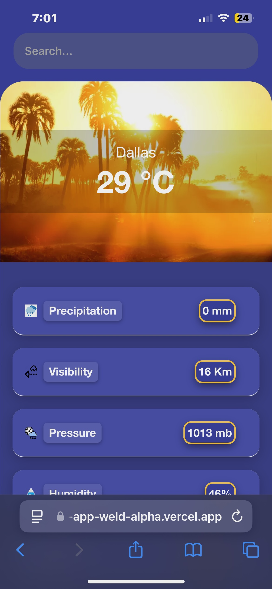
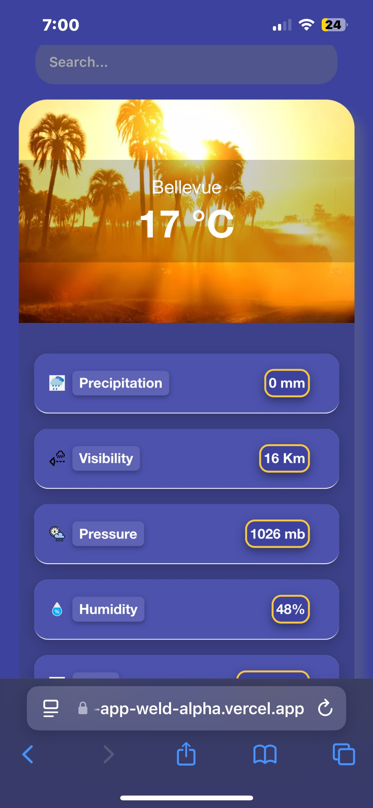
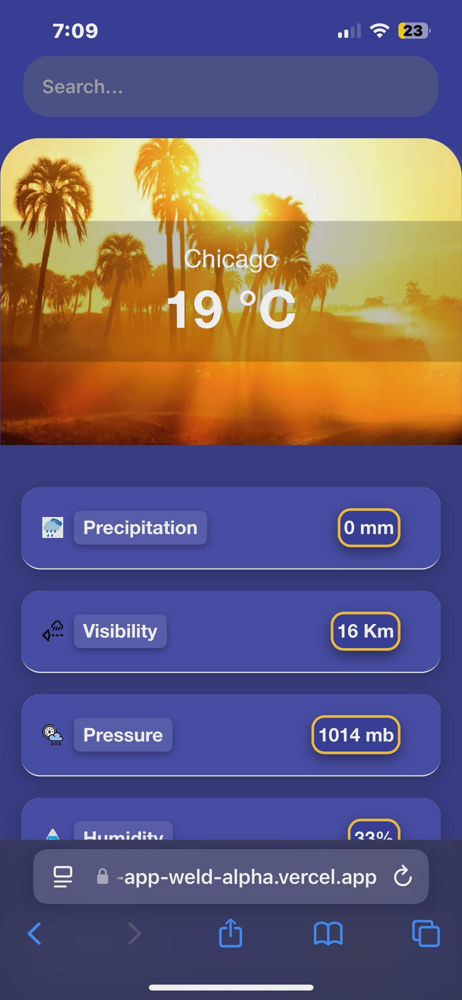

# Overview
This project utilizes the APJOY-WeatherForecast API, a robust and precise weather forecasting solution designed to deliver localized weather data and insights. By integrating this API, the application provides users with accurate, real-time weather information tailored to their specific needs.

This project was generated with [Angular CLI](https://github.com/angular/angular-cli) version 18.2.6.

## Build
Installation: Clone this repository and install the necessary dependencies.

```bash
git clone <repository-url>
cd <project-directory>
npm install
```

Run `ng serve` for a dev server. Navigate to `http://localhost:*/`. The application automatically reloads whenever you modify any source files. It is deployed on [Vercel](https://vercel.com),[MyWebsite](https://weather-app-weld-alpha.vercel.app/), and I am utilizing [WeatherAPI](https://rapidapi.com/weatherapi/api/weatherapi-com) to provide real-time information.

## Features
Real-time Weather Data: The application fetches the latest weather conditions, including temperature, humidity, wind speed, wind direction, and precipitation. This ensures users can make informed decisions based on current weather conditions.
User-Friendly Interface: The application presents weather data in an intuitive layout, making it easy for users to access and understand the information.
## Demo 


## Further help

To get more help on the Angular CLI use `ng help` or go check out the [Angular CLI Overview and Command Reference](https://angular.dev/tools/cli) page.
